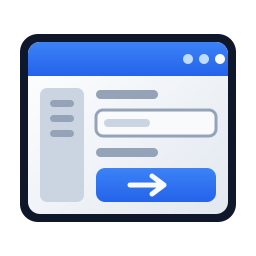

<p align="center">
  
</p>

<h1 align="center">GoForms</h1>

<p align="center">
  A Windows Forms-style GUI framework for Go.<br>
  <a href="https://go-forms.github.io/GoForms/">Website</a> ·
  <a href="docs/README.md">Documentation</a> ·
  <a href="https://github.com/Go-Forms/GoFormsDesigner">Designer</a> ·
  <a href="https://github.com/Go-Forms/GoFormsShowcase">Showcase</a>
</p>

<p align="center">
  <a href="https://github.com/Go-Forms/GoForms/actions/workflows/ci.yml"></a>
  
  
</p>

A Windows Forms-style GUI framework for Go. GoForms gives you the WinForms
mental model — a `Form` with absolutely-positioned `Control`s, C#-style
events (`button.Click.Handle(...)`), and a designer/logic file split for
every form — while the actual rendering, windowing and input handling is
done by [Fyne](https://fyne.io) underneath. That gets you fast, GPU-accelerated,
cross-platform rendering (Windows/Linux/macOS) without hand-writing a Win32
message loop.

GoForms is **not** a wrapper that just renames Fyne's API. It's a real
compatibility layer: absolute `X, Y, Width, Height` positioning instead of
Fyne's flex/grid layouts, a `Control` interface every widget implements,
container controls whose children are positioned relative to the container
(like WinForms, not like the screen), and a multicast `Event[T]` type that
behaves like a C# event.

## Quick example

```go
package main

import "goforms"

func main() {
	goforms.NewApplication("com.example.myapp")

	form := goforms.NewForm("Hello", 400, 200)
	label := goforms.NewLabel("Hello, World!")
	label.SetBounds(20, 20, 200, 24)
	form.AddControl(label)

	button := goforms.NewButton("Click me")
	button.SetBounds(20, 60, 100, 30)
	button.Click.Handle(func(sender any, e goforms.MouseEventArgs) {
		label.SetText("Clicked!")
	})
	form.AddControl(button)

	goforms.Run(form)
}
```

## Project layout convention

GoForms projects mirror a WinForms solution: one folder per form, each split
into a hand-written half and a designer half, plus a `main.go` that wires
everything up by hand (there is no runtime magic that discovers forms —
you `import` and construct them yourself, exactly like `Program.cs`).

```
YourApp/
  Forms/
    MainForm/
      MainForm.go            <- hand-written: event handlers, business logic
      MainForm-designer.go   <- generated-looking: field decls + layout
    SettingsForm/
      SettingsForm.go
      SettingsForm-designer.go
  main.go
  go.mod                     <- requires "goforms"; use a replace directive
                                 until GoForms is published to a real module path
```

The `-designer.go` file declares the form's struct (embedding `*goforms.Form`,
plus one field per control) and an `initializeComponent()` method that
constructs every control, sets its bounds, and wires its events to methods
defined in the *other* file:

```go
// MainForm-designer.go
type MainForm struct {
	*goforms.Form
	btnGreet *goforms.Button
}

func NewMainForm() *MainForm {
	mf := &MainForm{Form: goforms.NewForm("Main", 400, 300)}
	mf.initializeComponent()
	return mf
}

func (mf *MainForm) initializeComponent() {
	mf.btnGreet = goforms.NewButton("Greet")
	mf.btnGreet.SetBounds(20, 20, 100, 30)
	mf.btnGreet.Click.Handle(mf.btnGreet_Click)
	mf.AddControl(mf.btnGreet)
}
```

```go
// MainForm.go
func (mf *MainForm) btnGreet_Click(sender any, e goforms.MouseEventArgs) {
	// your logic here
}
```

This split is exactly so a future visual designer (see "VS Code designer" below)
could regenerate `*-designer.go` from a drag-and-drop canvas without ever
touching your hand-written logic.

### Adding GoForms to a new project

```
go mod init yourapp
```

```go.mod
require goforms v0.0.0
replace goforms => ../GoForms   // or wherever you cloned/vendored it
```

Then `go mod tidy`. Nothing else is needed — GoForms has no code generation
step and no CLI.

## Architecture

- **`Application`** (`app.go`) — one per process, wraps `fyne.App`.
  `goforms.NewApplication(id)` creates it; `goforms.Run(form)` shows a form
  as the main window and pumps Fyne's event loop (blocks until the app quits).
- **`Form`** (`form.go`) — wraps a `fyne.Window` plus an absolutely-positioned
  `container.NewWithoutLayout` surface. `AddControl`/`RemoveControl`/`Controls()`,
  `Text`/`SetText`, `ClientSize`/`SetClientSize`, `SetBackColor`, `CenterOnScreen`,
  `SetFixedSize`, `SetIcon`, `SetMainMenu`, `Show`/`Hide`/`Close`, and
  `ShowDialog()`/`CloseWithResult()` for modal-style dialogs (see below).
  Lifecycle events: `Load`, `Closing` (cancelable via `*CancelEventArgs`),
  `Closed`, `Resize`, `KeyDown`.
- **`Control`** (`control.go`) — the interface every widget implements:
  `Object()`, `Bounds()`/`SetBounds`/`SetLocation`/`SetSize`, `Name`/`Tag`,
  `Visible`/`Enabled`, `SetContextMenu`. **`ControlBase`** is the struct every
  concrete control embeds to get all of this for free — a new control only
  has to construct its Fyne widget and call `initBase(widget, width, height)`.
- **`ContainerControl`** (`containercontrol.go`) — the base for controls that
  host children *relative to their own top-left corner* rather than the
  form's (Panel, GroupBox, ScrollBox, TabPage): `AddControl`/`RemoveControl`/`Controls()`.
- **`Event[T]`** (`events.go`) — a minimal multicast delegate:
  `event.Handle(func(sender any, args T) { ... })` mirrors `event += handler`,
  `event.Fire(sender, args)` mirrors raising it. `EventArgs` is the base type;
  `CancelEventArgs` (used by `Form.Closing`) is deliberately handled via a
  `*CancelEventArgs` type parameter instead of a value, since `Event[T]` passes
  `T` by value to every handler — a plain `CancelEventArgs` handler couldn't
  report `Cancel = true` back to the raiser otherwise.

### A note on Go vs. C# here

Go has no virtual dispatch through struct embedding. A control that embeds
`ControlBase`/`ContainerControl` and needs extra work on resize (e.g. Panel
resizing its background rectangle, GroupBox resizing its content area) has to
**redeclare** `SetBounds`/`SetSize`/`SetLocation` itself, calling the embedded
type's version first. See `panel.go`, `groupbox.go`, `scrollbox.go`, `splitter.go`,
`statusstrip.go`, `numericupdown.go` for the pattern. If you add a control
with its own chrome that must track its size, copy this pattern — otherwise
your control will silently ignore resizes made through the base type's methods.

## Control catalog

**Input controls:** `Button`, `TextBox` (`NewTextBox`/`NewMultilineTextBox`/`NewPasswordTextBox`),
`CheckBox`, `RadioButton` + `RadioButtonGroup` (mutual exclusivity is opt-in —
GoForms containers have no implicit "same parent = same group" behavior),
`ComboBox`, `ListBox`, `TrackBar` (slider), `NumericUpDown`, `DateTimePicker`
(button + popup calendar), `ColorDialog` / `ColorPickerButton`,
`MaskedTextBox` (WinForms mask characters `0 9 L ? A #`), `CheckedListBox`,
`MonthCalendar`, `DomainUpDown`, `ScrollBar`
(`NewHScrollBar`/`NewVScrollBar`).

**Display controls:** `Label` (canvas-text based, so it honours `Font`,
`ForeColor` and `TextAlign`), `PictureBox` (`LoadFile`/`LoadImage`,
`SizeMode`), `ProgressBar`, `LinkLabel`, `RichTextBox` (Markdown, not RTF —
that is what Fyne's `RichText` parses).

**Containers:** `Panel`, `GroupBox`, `ScrollBox` (viewport + independently
sized, scrollable content area — see below), `TabControl` + `TabPage`,
`Splitter` (`NewHorizontalSplitter`/`NewVerticalSplitter`),
`SplitContainer` (two real `Panel`s plus a draggable bar),
`FlowLayoutPanel` (wrapping flow in any of the four directions) and
`TableLayoutPanel` (grid with `Absolute`/`Percent`/`AutoSize` tracks and
row/column spanning).

**Data/structure controls:** `ListView` (multi-column "Details" view, `widget.Table`-backed),
`DataGridView` (editable grid — see below), `TreeView` + `TreeNode`.

**Menus & chrome:** `MenuStrip` + `TopMenu` + `MenuItem` (`Form.SetMainMenu`),
`ContextMenu` (`Control.SetContextMenu` — see limitation below), `ToolStrip`,
`StatusStrip` + `StatusStripPanel`.

**Dialogs:** `ShowMessageBox` (OK / OK-Cancel / Yes-No), `ShowInputBox`,
`OpenFileDialog`, `SaveFileDialog`, `FolderBrowserDialog`. All of them report
through a callback rather than blocking and returning a `DialogResult`: Fyne
draws dialogs on the UI goroutine, so a blocking call would deadlock the very
thread that has to paint them.

**Non-visual:** `Timer` (`Start`/`Stop`, `Tick` event, runs on a real
`time.Ticker` and marshals back to the UI thread via `fyne.Do`), `ToolTip`
(built on the `MouseEnter`/`MouseLeave` events every control raises, so it
works on any of them), `ImageList`.

**Layout:** every control has `Anchor` (`AnchorTop|AnchorLeft|...`), `Dock`
(`DockTop`/`Bottom`/`Left`/`Right`/`Fill`) and `Padding`, applied by the
parent whenever it resizes. Anchoring opposite edges stretches instead of
moving, exactly as in WinForms; docked controls carve up the client area
first and anchors are measured against what is left.

Fyne gives no window-resize callback, so all of this rides on a custom
`fyne.Layout` installed on each parent's container — that is also what
raises `Form.Resize`.

**Styling:** `style.go` — `Color` (= `color.Color`), `RGB`/`RGBA` helpers,
`TextAlign`, and `Font` (`Family`, `Size`, `Bold`, `Italic`). `Control` has
`SetFont`, `SetForeColor`, `SetBackColor`, `SetTabIndex` and `SetTabStop`.

The value is always recorded so the designer can read it back, but it only
changes what you *see* on controls that render their own text or background —
`Label`, `GroupBox`'s caption, `Panel`, `FlowLayoutPanel`, `TableLayoutPanel`,
`ScrollBox`. Fyne draws its built-in widgets with the theme's font and colour
and exposes no per-instance override. Ask `control.FontSupported()` rather
than guessing.

### Events: every control has the full Control surface

Every control embeds `ControlBase`, which embeds `ControlEvents`, so this
works on any of them:

```go
btn.Click.Handle(func(sender any, e goforms.MouseEventArgs) {
    b := sender.(*goforms.Button)      // sender is the concrete control
    log.Printf("%s clicked at %v,%v", b.Name(), e.X, e.Y)
})

txt.KeyPress.Handle(func(_ any, e goforms.KeyPressEventArgs) {
    log.Printf("typed %q", e.KeyChar)
})
```

| Group | Events |
|---|---|
| Pointer | `Click`, `DoubleClick`, `MouseDown`, `MouseUp`, `MouseMove`, `MouseEnter`, `MouseLeave`, `MouseWheel` |
| Keyboard | `KeyDown`, `KeyUp`, `KeyPress` |
| Focus | `GotFocus`, `LostFocus` |
| Lifecycle | `Resize`, `Move`, `VisibleChanged`, `EnabledChanged` |

Coordinates in `MouseEventArgs` are relative to the control that raised the
event, as in WinForms. `sender` is the concrete control once it has been
added to a Form or container (that is where it learns what it is).

**How this works, and why it matters.** Fyne runs its hit test *once* per
event: it finds the topmost object implementing *any* interaction interface
and only then decides what to call on it. So wrapping a widget in an outer
object loses every event to that widget as soon as it implements even one of
those interfaces — and nearly all of them implement `fyne.Focusable`. That
is why context menus never worked on interactive controls.

`initBase` therefore puts a transparent `interactionArea` **on top of** each
control's widget (see `interaction.go`). It wins the hit test uniformly,
raises the GoForms events, and then forwards the event to the widget beneath
so the control keeps working — clicks still press buttons, typing still
reaches text boxes, hovering still highlights.

Containers are the exception: their overlay goes *below* their children, so
a click on a child reaches the child and a click on empty space reaches the
container, exactly as WinForms behaves.

> Side effect worth knowing: `SetContextMenu` now works on **every** control,
> including `TextBox`, `ListBox`, `ComboBox` and `ListView`, which the old
> wrapper approach could never support.

Two honest limitations:

- Fyne reports modifier state only with *mouse* events, never with key
  events, so `KeyEventArgs`' `Shift`/`Control`/`Alt`/`Super` carry the most
  recent state the toolkit reported. For reliable Ctrl-combinations use
  Fyne's shortcut support on the Form's canvas.
- `Handled` is advisory: Fyne offers no way to stop an already-dispatched
  key from reaching the underlying widget.

### GroupBox draws its own frame

`GroupBox` paints its frame directly — five border segments plus the caption,
with the top line interrupted around the text — instead of using Fyne's
`widget.Card`.

`Card` was the obvious shortcut and was wrong twice over: it renders a
rounded, elevated panel with an oversized title that looks nothing like a
group box, and it *insets its content*, so every child was drawn well below
the coordinates it was given. That inset broke `ContainerControl`'s contract
(children are relative to the container's own top-left) and made the visual
designer disagree with the running app.

A child at `SetBounds(10, 20, ...)` now appears at exactly (10, 20) inside
the group box, the same as in a `Panel`. The caption occupies roughly the
top `CaptionHeight()` pixels; the designer draws that strip so you can see
not to place controls under it.

> The frame geometry is a set of plain constants (`groupBoxCaptionX`,
> `groupBoxCaptionGap`, `groupBoxBorderWidth`) rather than theme lookups,
> precisely so `renderGroupBox` in `media/designer.js` can reproduce it
> exactly. Change both together.

### DataGridView: sizing and scrolling

`DataGridView` is the editable, tabular counterpart to `ListView`. Where
`ListView` is a read-only report list, `DataGridView` gives you per-column
sizing policies, per-axis scrolling and in-place cell editing.

```go
grid := goforms.NewDataGridView("Order", "Customer", "Total")
grid.SetBounds(20, 20, 520, 180)
grid.AddRow("1001", "Acme Corp", "$1,240.00")

grid.SetAutoSizeColumnsMode(goforms.SizeFill) // share the width
grid.SetScrollBars(goforms.ScrollBarsVertical)
grid.SetRowHeight(28)

grid.CellValueChanged.Handle(func(sender any, e goforms.GridCellValueEventArgs) {
    log.Printf("row %d col %d: %q -> %q", e.Row, e.Col, e.OldValue, e.NewValue)
})
```

**Column width** (`GridColumn.SizeMode`, or `SetAutoSizeColumnsMode` for all
columns at once):

| Mode | Behavior |
|---|---|
| `SizeFixed` | uses `GridColumn.Width` as-is (the default) |
| `SizeToContent` | measures every cell and takes the widest, clamped to `MinWidth`/`MaxWidth` |
| `SizeFill` | splits the space the other columns left over, in proportion to `FillWeight` |

**Row height:** `SetRowHeight(h)` for a fixed height, or
`SetAutoSizeRowsMode(SizeToContent)` to measure each row's tallest cell
(multi-line values get the room they need). The fixed height always acts as
a floor.

**Scrolling** (`SetScrollBars`) is honored on both axes, but by different
mechanisms, because Fyne's `widget.Table` always owns its own scroll
container and can't have a scrollbar switched off:

- **Horizontal off** — columns are *fitted* into the viewport width. `Fill`
  columns absorb the slack; with none, every column shrinks proportionally,
  never below its `MinWidth`.
- **Vertical off** — the grid grows its own height to fit every row. This
  deliberately makes the control taller than the height passed to
  `SetBounds`, mirroring `DataGridView.AutoSize`; `Bounds()` still reports
  what you set, so the designer round-trips correctly.

**Editing:** cells are editable unless the grid or the column is
`ReadOnly`. Clicking a cell selects it; clicking the already-selected cell
opens its editor (Fyne's `Table` has no double-tap of its own, so this is
the closest faithful gesture). `BeginEdit`/`EndEdit` drive it from code.
`CellValueChanged` fires for user edits only — `SetCell` is silent, exactly
as in WinForms.

> The visual designer re-implements this whole sizing policy in
> `media/designer.js` so the canvas shows what will really appear. If you
> change the policy here, change it there too — the port is marked with a
> comment pointing back at this file.

### ScrollBox and relative coordinates

`ScrollBox` is the AutoScroll-style container: it has a fixed **viewport**
size (what's visible) and an independently resizable **content** size (call
`SetContentSize(w, h)` to make it larger than the viewport, which is what
makes it scroll). Children you `AddControl` onto it are positioned relative
to the *content area*, never the viewport or the screen — exactly like
`Panel.AutoScroll` in WinForms, where a child's `Location` doesn't change as
the user scrolls.

### Switching between forms / dialogs

Multiple forms are just multiple `*goforms.Form` values — show, hide or close
them independently with `Show()`/`Hide()`/`Close()`. For modal-style dialogs,
use `ShowDialog()`, which blocks the *calling goroutine* until the dialog
closes and returns whatever `DialogResult` was passed to `CloseWithResult`:

```go
button.Click.Handle(func(sender any, e goforms.EventArgs) {
	// ShowDialog blocks - it must never run on the UI goroutine, or it
	// freezes the whole app (including the dialog you're trying to show).
	go func() {
		dlg := NewSettingsForm()
		result := dlg.ShowDialog()
		fyne.Do(func() {
			if result == goforms.DialogOK {
				// ...
			}
		})
	}()
})
```

This is the one place GoForms' single-threaded Fyne event loop leaks through
the WinForms illusion: `Form.ShowDialog` is documented in `form.go` with the
same warning.

### Context menus (previously a known limitation)

`Control.SetContextMenu` now works on **every** control, including the
interactive ones (`TextBox`, `ListBox`, `ComboBox`, `ListView`, `TreeView`,
...).

It used to work only on passive controls. Fyne resolves a click by finding
the topmost object implementing *any* interaction interface and only then
deciding what to call on it, so an outer right-click-only wrapper lost the
event to any widget implementing even one of those interfaces - which is
nearly all of them. `ListBox` carried a bespoke `listWidget` purely to work
around this.

The interaction overlay (see "Events" above) sits *on top of* each control
instead of wrapping it, so it wins the hit test uniformly. `listWidget` and
the `contextMenuHost` escape hatch are both gone.

## Extending GoForms

Anyone can add a new control as long as it follows the pattern:

1. Embed `ControlBase` (leaf control) or `ContainerControl` (holds children
   at container-relative coordinates).
2. Construct your Fyne widget, wire its callbacks to `Event[T]` fields, call
   `initBase(widget, width, height)` (or `initContainer(outer, inner, w, h)`
   for containers with their own chrome, e.g. `GroupBox`'s card).
3. If your control has its own chrome that must resize (a background rect,
   an inner content container, ...), redeclare `SetBounds`/`SetSize`/`SetLocation` —
   see "A note on Go vs. C#" above.
4. One file per control, doc comments phrased as `X mirrors System.Windows.Forms.Y`.

That's the whole contract — no registration step, no interface beyond `Control`.

## Future work

- A VS Code extension for visually editing `*-designer.go` (drag/resize
  controls on a canvas, regenerate the designer file, look up or stub event
  handlers in the paired hand-written file). Not started.
- Extend the `contextMenuHost` fix to the rest of the interactive controls.
- Per-control styling (Font, ForeColor) beyond what a handful of controls
  expose today, once Fyne's per-widget theming story allows it.
