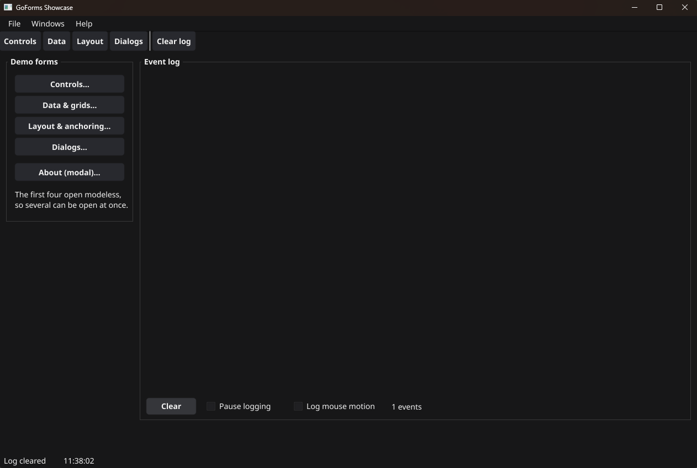
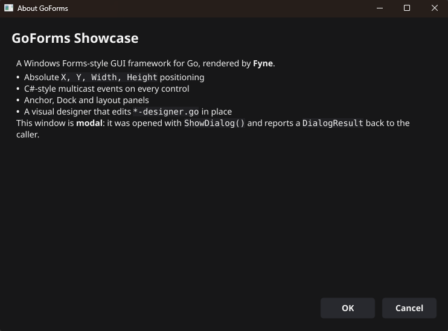
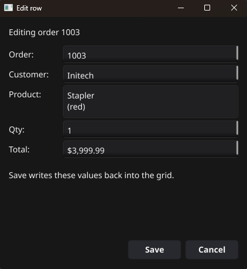

# GoForms

A Windows Forms-style UI library for Go, plus a visual designer for VS Code.

If you know WinForms, you already know this: you create a form, drop controls
on it, position them with `SetBounds`, wire events with `+=` (here, `.Handle`),
and let docking and anchoring deal with resizing. Names, semantics and event
signatures mirror `System.Windows.Forms` deliberately, so existing knowledge
transfers rather than having to be relearned.

Rendering is done by [Fyne](https://fyne.io), which GoForms wraps - but you do
not write Fyne code to use it.



## Contents

For the narrative version — moving between forms, modal and custom dialogs,
swapping views inside one window, the UI-thread rule, and every designer
command — see **[the guide](https://go-forms.github.io/GoForms/guide.html)**.
The documents below are the per-topic reference.

| Document | What is in it |
|---|---|
| [controls.md](controls.md) | Every control, its WinForms equivalent, and how to build it |
| [layout.md](layout.md) | Docking, anchoring, containers - and the resizing traps |
| [events.md](events.md) | The event model, handler signatures, the partial-class split |
| [designer.md](designer.md) | The VS Code visual designer |

## A form from scratch

A GoForms form is split in two files, exactly as a WinForms form is split into
`Form1.cs` and `Form1.Designer.cs`:

```
Forms/MainForm/
    MainForm-designer.go    generated half: fields, construction, layout
    MainForm.go             your half: event handlers
```

The designer file holds a struct embedding `*goforms.Form`, a constructor, and
an `initializeComponent` method. Nothing else. That shape is what the visual
designer reads and writes.

**`Forms/MainForm/MainForm-designer.go`**

```go
package mainform

import "github.com/Go-Forms/GoForms"

type MainForm struct {
	*goforms.Form

	lblName  *goforms.Label
	txtName  *goforms.TextBox
	btnGreet *goforms.Button
}

func NewMainForm() *MainForm {
	mf := &MainForm{Form: goforms.NewForm("Hello", 420, 200)}
	mf.initializeComponent()
	return mf
}

func (mf *MainForm) initializeComponent() {
	mf.SetClientSize(420, 200)

	mf.lblName = goforms.NewLabel("Your name:")
	mf.lblName.SetBounds(20, 24, 100, 24)
	mf.AddControl(mf.lblName)

	mf.txtName = goforms.NewTextBox()
	mf.txtName.SetBounds(130, 20, 260, 30)
	mf.txtName.SetAnchor(goforms.AnchorTop | goforms.AnchorLeft | goforms.AnchorRight)
	mf.AddControl(mf.txtName)

	mf.btnGreet = goforms.NewButton("Greet")
	mf.btnGreet.SetBounds(300, 70, 90, 30)
	mf.btnGreet.SetAnchor(goforms.AnchorTop | goforms.AnchorRight)
	mf.btnGreet.Click.Handle(mf.btnGreet_Click)
	mf.AddControl(mf.btnGreet)
}
```

**`Forms/MainForm/MainForm.go`**

```go
package mainform

import "github.com/Go-Forms/GoForms"

func (mf *MainForm) btnGreet_Click(sender any, e goforms.MouseEventArgs) {
	goforms.ShowMessageBox(mf.Form, "Hello, "+mf.txtName.Text()+"!", "Greeting",
		goforms.MessageBoxOK, goforms.MessageBoxInformation, nil)
}
```

**`main.go`** - the equivalent of `Program.cs`:

```go
package main

import (
	"github.com/Go-Forms/GoForms"

	mainform "myapp/Forms/MainForm"
)

func main() {
	goforms.NewApplication("com.example.myapp")
	goforms.Run(mainform.NewMainForm().Form)
}
```

`go run .` and you have a window.

## Project layout

```
go.mod          requires goforms, with a replace pointing at your checkout
main.go         NewApplication + Run
Forms/
    MainForm/
        MainForm-designer.go
        MainForm.go
```

The designer's `GoForms: Create New Project...` command scaffolds exactly
this, so there is nothing to remember.

## Opening a second form

Forms are ordinary values. Modeless:

```go
func (mf *MainForm) btnSettings_Click(sender any, e goforms.MouseEventArgs) {
	settingsform.NewSettingsForm().Show()
}
```

Modal, blocking until the window closes and reporting what the user chose:

```go
about := aboutform.NewAboutForm()
if about.ShowDialog() == goforms.DialogOK {
	// ...
}
```



Keep a reference if you want at most one instance, and clear it on `Closed` -
[the showcase's MainForm](https://github.com/Go-Forms/GoFormsShowcase/blob/main/Forms/MainForm/MainForm.go)
does this for its four demo windows.

A dialog that edits something and reports what it collected is the same thing
with a `DialogResult`: the showcase's row editor fills itself from the grid
row, validates in the form rather than closing on bad input, and hands the
values back when Save sets `DialogOK`.



## The showcase

`GoFormsShowcase` is a working application that exercises everything, with a
live event log so you can see what fires and when.

```
cd GoFormsShowcase
go run .
```

Every screenshot in this documentation comes from it, produced by
[`docs/tools/capture.ps1`](tools/capture.ps1). To photograph one form on its
own - `main`, `controls`, `data`, `layout`, `dialogs`, `about` or `editrow`:

```
go run ./cmd/shot layout
```

## Status

Faithful to WinForms in naming, event signatures, docking and anchoring
semantics. Not faithful in: `FormBorderStyle` variants, RTF (the RichTextBox
renders Markdown, which is what Fyne parses), and per-control fonts beyond
what `style.go` exposes.
