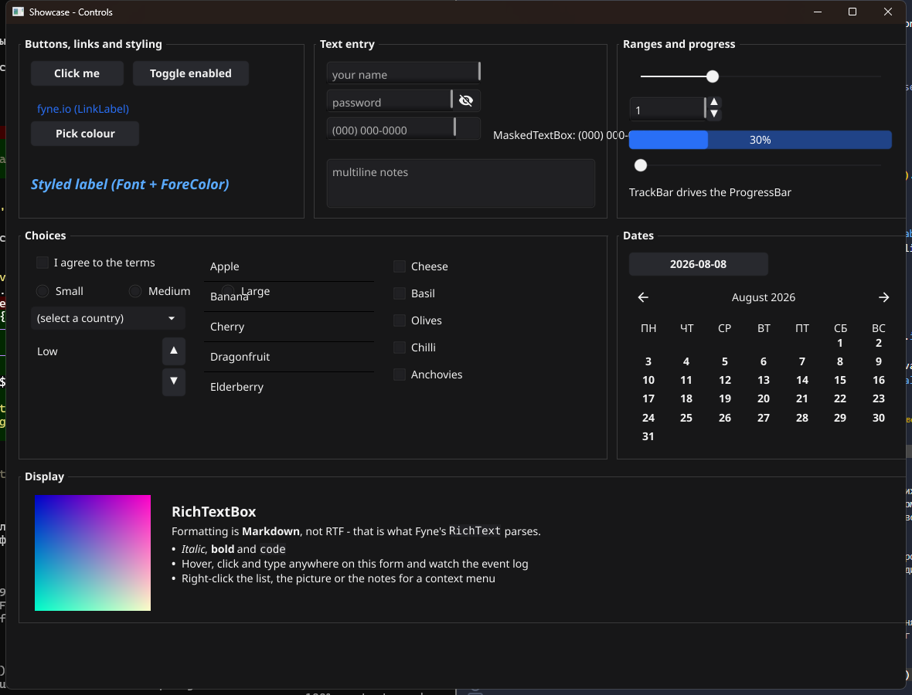
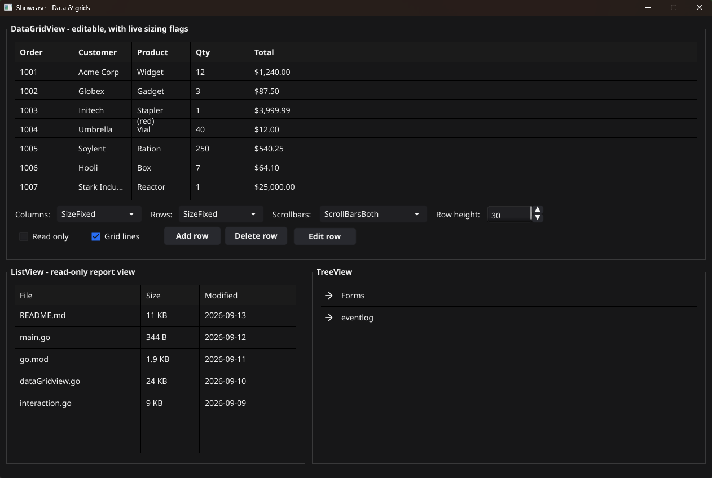
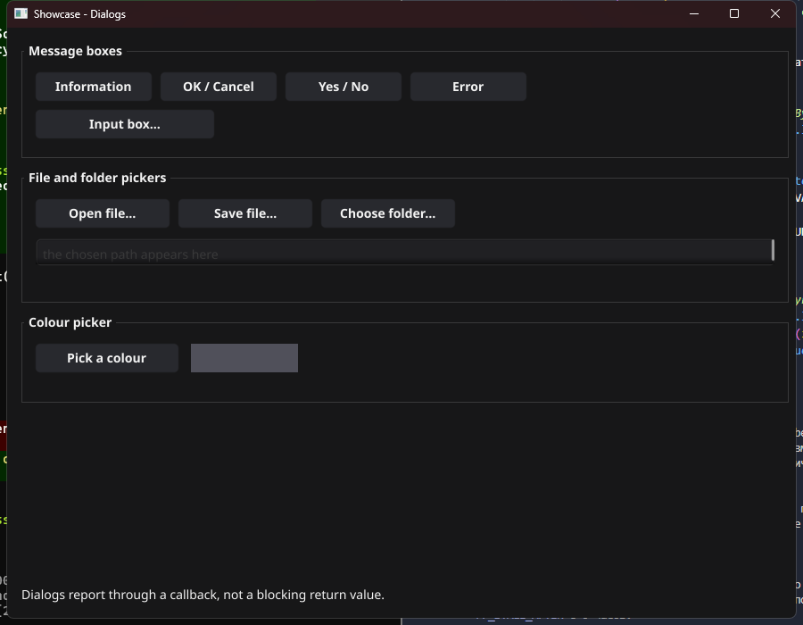

# Controls

Thirty-four control types, grouped the way the Visual Studio toolbox groups
them. Every one is a `Control`: it has `SetBounds`, `SetAnchor`, `SetDock`,
`SetVisible`, `SetEnabled`, a context menu, and the full interaction event set
described in [events.md](events.md).



## Common controls

| Control | WinForms | Constructor |
|---|---|---|
| `Label` | Label | `NewLabel(text)` |
| `Button` | Button | `NewButton(text)` |
| `TextBox` | TextBox | `NewTextBox()`, `NewMultilineTextBox()`, `NewPasswordTextBox()` |
| `MaskedTextBox` | MaskedTextBox | `NewMaskedTextBox(mask)` |
| `RichTextBox` | RichTextBox | `NewRichTextBox(markdown)` |
| `CheckBox` | CheckBox | `NewCheckBox(text)` |
| `RadioButton` | RadioButton | `NewRadioButton(text)` |
| `ComboBox` | ComboBox | `NewComboBox(items...)` |
| `ListBox` | ListBox | `NewListBox(items...)` |
| `CheckedListBox` | CheckedListBox | `NewCheckedListBox(items...)` |
| `DomainUpDown` | DomainUpDown | `NewDomainUpDown(items...)` |
| `NumericUpDown` | NumericUpDown | `NewNumericUpDown(min, max, value)` |
| `TrackBar` | TrackBar | `NewTrackBar(min, max)` |
| `ProgressBar` | ProgressBar | `NewProgressBar()` |
| `ScrollBar` | HScrollBar / VScrollBar | `NewHScrollBar(min, max)`, `NewVScrollBar(min, max)` |
| `DateTimePicker` | DateTimePicker | `NewDateTimePicker(time.Now())` |
| `MonthCalendar` | MonthCalendar | `NewMonthCalendar(time.Now())` |
| `PictureBox` | PictureBox | `NewPictureBox(w, h)` |
| `LinkLabel` | LinkLabel | `NewLinkLabel(text)`, `NewLinkLabelWithURL(text, url)` |
| `ColorPickerButton` | ColorDialog + Button | `NewColorPickerButton(text, form)` |

`RichTextBox` renders **Markdown**, not RTF - that is the format Fyne's
`RichText` parses. It is the one deliberate departure from the WinForms
original.

## Containers

| Control | WinForms | Constructor |
|---|---|---|
| `Panel` | Panel | `NewPanel(w, h)` |
| `GroupBox` | GroupBox | `NewGroupBox(caption, w, h)` |
| `TabControl` | TabControl | `NewTabControl(w, h)` |
| `ViewContainer` | TabControl with a movable strip | `NewViewContainer(w, h)` |
| `SplitContainer` | SplitContainer | `NewSplitContainer(w, h, vertical)` |
| `Splitter` | Splitter | `NewHorizontalSplitter(w, h)`, `NewVerticalSplitter(w, h)` |
| `ScrollBox` | Panel with AutoScroll | `NewScrollBox(w, h)` |
| `FlowLayoutPanel` | FlowLayoutPanel | `NewFlowLayoutPanel(w, h)` |
| `TableLayoutPanel` | TableLayoutPanel | `NewTableLayoutPanel(w, h, cols, rows)` |

See [layout.md](layout.md) for how each one places its children - three of them
take children only through a half or a page.

## Menus and toolbars

| Control | WinForms | Constructor |
|---|---|---|
| `ToolStrip` | ToolStrip | `NewToolStrip()` |
| `StatusStrip` | StatusStrip | `NewStatusStrip(w, h)` |
| `MenuStrip` | MenuStrip | `NewMenuStrip()` - via `form.SetMainMenu` |
| `ContextMenu` | ContextMenuStrip | `NewContextMenu()` - via `control.SetContextMenu` |

```go
ts := goforms.NewToolStrip()
ts.AddButton("New", mf.newFile)      // the callback is a plain func()
ts.AddSeparator()
ts.AddButton("Open", mf.openFile)
ts.SetDock(goforms.DockTop)
mf.AddControl(ts)
```

A `ToolStrip` grows to fit its buttons but never shrinks below a width you set
yourself, so an explicit `SetBounds` (or a dock) is respected.

## Data

| Control | WinForms | Constructor |
|---|---|---|
| `ListView` | ListView (Details view) | `NewListView([]string{cols...})` |
| `TreeView` | TreeView | `NewTreeView()` |
| `DataGridView` | DataGridView | `NewDataGridView(cols...)` |



```go
grid := goforms.NewDataGridView("Order", "Customer", "Total")
grid.AddRow("1001", "Acme", "£240.00")
grid.SetAutoSizeColumnsMode(goforms.SizeFill)
grid.SetGridLines(true)

tree := goforms.NewTreeView()
root := tree.AddNode(nil, "Project")
tree.AddNode(root, "main.go")
```

`DataGridView` supports frozen columns and rows, per-column alignment and
sizing modes, read-only cells, and click-then-click-again editing.

A column can also hold something other than text, and can carry data without
showing it:

```go
grid := goforms.NewDataGridView("ID", "Customer", "Status", "")
grid.SetColumnHidden(0, true)                            // the row's id, carried but not drawn
grid.SetColumnKind(2, goforms.GridColumnCheckBox)        // "true"/"false", ticked in place
grid.SetColumnKind(3, goforms.GridColumnButton)          // a per-row action
grid.SetColumnButtonText(3, "Assign")

grid.AddRow("1001", "Acme", "true", "")
grid.CellButtonClick.Handle(func(_ any, e goforms.GridCellEventArgs) {
    id := grid.Cell(e.Row, 0)   // the hidden column is still readable
    assign(id)
})
```

`GridColumnButton` makes every cell a button and reports presses through
`CellButtonClick`; leaving `ButtonText` empty uses each cell's own value as its
caption, so one column can say "Approve" on one row and "Revoke" on the next.
`GridColumnCheckBox` stores `"true"`/`"false"` and reports toggles through
`CellValueChanged`, like any other edit.

Hiding a column never renumbers anything: `Cell`, `CellByName`, `AddRow` and
every event argument keep speaking in column indices, so a hidden id column is
read exactly as if it were on screen. `VisibleColumns()` reports what is
actually drawn, in order.

## Components without a visual presence

| Type | WinForms | Notes |
|---|---|---|
| `Timer` | Timer | `NewTimer(ms)`, `Start()`, `Stop()`; ticks coalesce like `WM_TIMER` |
| `ToolTip` | ToolTip | `SetToolTip(control, text)` |
| `ImageList` | ImageList | a named set of images |
| `RadioButtonGroup` | (implicit in WinForms) | makes a set of radio buttons exclusive |

Radio buttons are not grouped by their container here - say so explicitly:

```go
g := goforms.NewRadioButtonGroup()
g.Add(rbSmall)
g.Add(rbLarge)
```

## Dialogs



Dialogs report their outcome through a **callback**, and this is the one place
where the WinForms shape could not be kept. `MessageBox.Show` returns a
`DialogResult` because Win32 pumps messages while it blocks; Fyne has no
equivalent, and blocking here would deadlock the very thread that has to draw
the dialog. So there is no return value to wait for.

```go
// A plain notice - nil callback, nothing to decide.
goforms.ShowMessageBox(mf.Form, "Saved.", "Done",
    goforms.MessageBoxOK, goforms.MessageBoxInformation, nil)

// A question. The rest of the work goes inside the callback, which is where
// WinForms would have had the code after the `if`.
goforms.ShowMessageBox(mf.Form, "Delete this file?", "Confirm",
    goforms.MessageBoxYesNo, goforms.MessageBoxQuestion,
    func(r goforms.DialogResult) {
        if r == goforms.DialogYes {
            mf.deleteFile()
        }
    })

goforms.ShowInputBox(mf.Form, "Rename", "New name:", func(text string, ok bool) {
    if ok {
        mf.rename(text)
    }
})
```

File and colour dialogs are objects you configure and then show, mirroring
`OpenFileDialog` / `ColorDialog` being classes in WinForms:

```go
dlg := goforms.NewOpenFileDialog()
dlg.Title = "Open a note"
dlg.Show(mf.Form, func(path string, ok bool) {
    if ok {
        data, err := dlg.ReadAll()
        _ = data
        _ = err
    }
})
```

`NewSaveFileDialog` (with `WriteAll`), `NewFolderBrowserDialog` and
`NewColorDialog` follow the same shape.

Every dialog is parented to the form you pass, so it appears over the right
window rather than over whichever one happens to be in front.

## Styling

`style.go` exposes what a WinForms developer reaches for most:

```go
lbl.SetForeColor(goforms.RGB(80, 140, 220))
lbl.SetFont(goforms.Font{Size: 15, Bold: true, Italic: true})
pnl.SetBackColor(goforms.RGB(30, 30, 34))
```

Colours are `color.Color`, so anything from `image/color` works; `RGB` and
`RGBA` are conveniences. A form-wide look is set with `goforms.SetTheme`.
