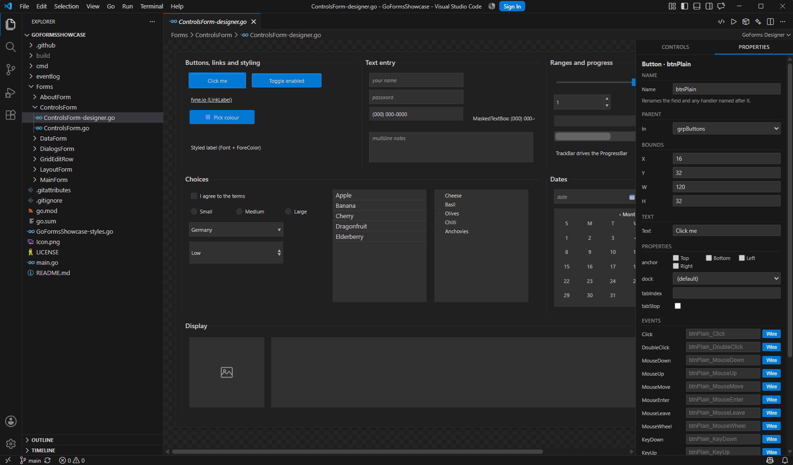
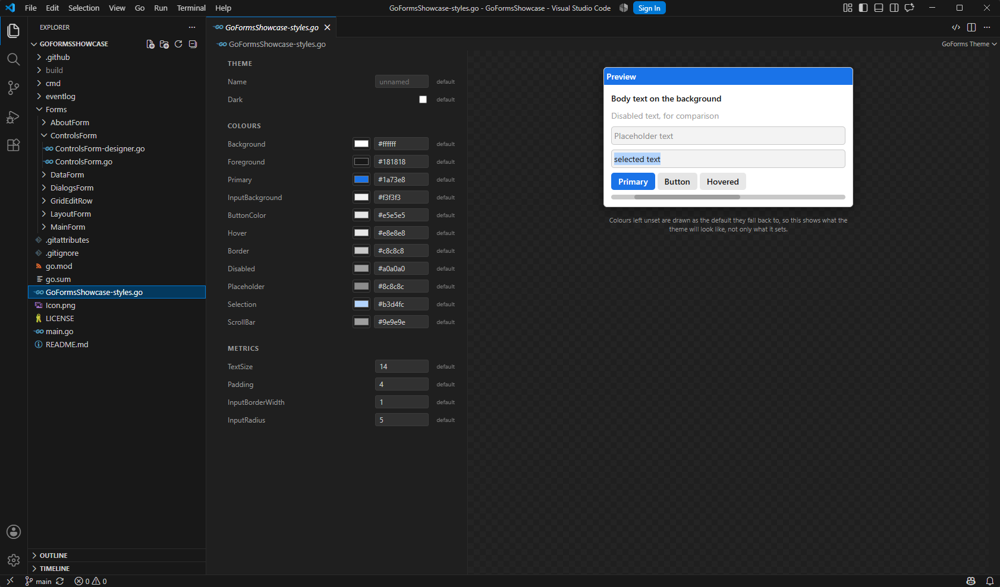
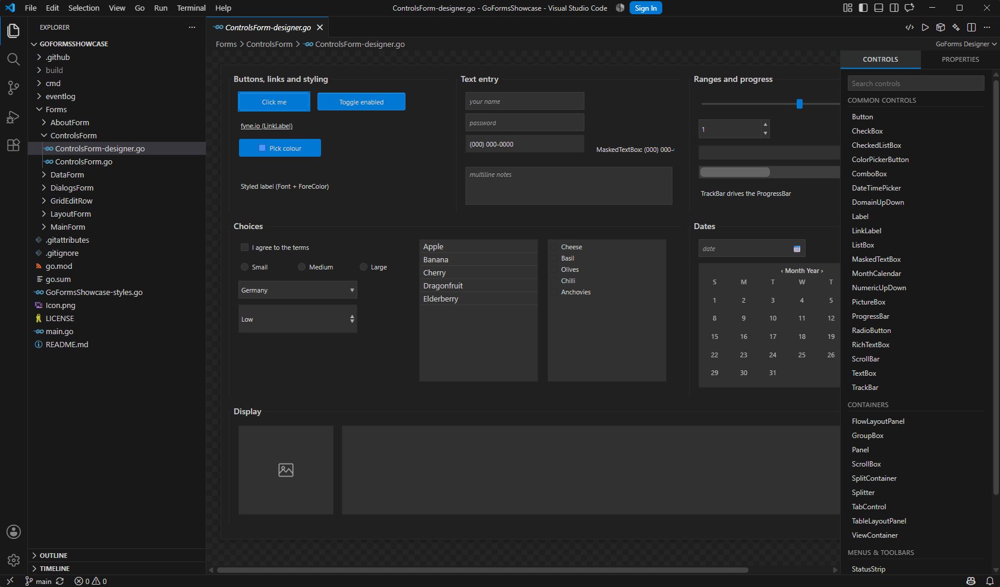

# The visual designer

A VS Code extension that edits `*-designer.go` files as a drag-and-drop canvas,
the way the Visual Studio form designer edits `Form1.Designer.cs`.

It is not a code generator you run once. The file on disk is the model: the
extension parses your Go source, shows it, and writes your edits back into the
same source. Anything it does not recognise is left untouched.



## Installing

Take the `.vsix` from the [latest release](https://github.com/Go-Forms/GoFormsDesigner/releases/latest),
or build it yourself:

```
cd GoFormsDesigner
npm install
npm run package
code --install-extension goforms-designer-0.10.1.vsix
```

If you use VS Code **profiles**, install into the one you actually work in -
otherwise the extension is registered but invisible:

```
code --profile "My profile" --install-extension goforms-designer-0.10.1.vsix
```

Reload the window afterwards (`Developer: Reload Window`); a running instance
does not pick up a CLI install.

The extension builds its Go helper on first use, so `go` has to be on `PATH`.

## Commands

| Command | What it does |
|---|---|
| `GoForms: Create New Project...` | scaffolds `main.go`, `go.mod`, a first form, build tasks and a `.gitignore` |
| `GoForms: New Form...` | adds a `Forms/<Name>/` pair |
| `GoForms: Open Visual Designer` | opens the canvas for the current file |
| `GoForms: Open as Text` | back to the Go source |
| `GoForms: Tidy Designer File` | runs the cleanup pass on a file edited elsewhere |
| `GoForms: Edit Theme` | opens `<name>-styles.go` as the theme editor |
| `GoForms: Open Theme as Text` | back to the Go source |
| `GoForms: Build...` | asks for a target: desktop, WebAssembly or Android |
| `GoForms: Build for Desktop` | `go build` into `build/desktop/` |
| `GoForms: Run on Desktop` | builds and runs; also the toolbar's play button |
| `GoForms: Build for WebAssembly` | compiles for the browser and assembles `build/wasm/` |
| `GoForms: Serve WebAssembly Build in Browser` | serves that build on a loopback port and opens it |
| `GoForms: Build for Android (APK)` | packages an APK into `build/android/` |
| `GoForms: Install APK on Connected Device (adb)` | installs the newest APK over adb |
| `GoForms: Check Setup` | which Go was found, where it looked, and what is present for each target |
| `GoForms: Set Framework Path...` | points a project at your GoForms checkout |
| `GoForms: Set Android NDK Path...` | for an NDK the search does not cover |
| `GoForms: Set fyne CLI Path...` | likewise for the fyne tool |
| `GoForms: Open Setup Guide` | the bundled guides for Android, fyne and WebAssembly |

Opening any `*-designer.go` gives you the designer by default.

## The theme editor

`<name>-styles.go` holds the one `goforms.Theme` literal that decides how the
whole application looks, and opens as an editor of its own: a picker and a hex
box per colour, numbers for the metrics, and a preview beside them. A field
left unset keeps the toolkit default and is still drawn in the preview as the
default it falls through to, so the preview shows what the theme *will* look
like rather than only what it sets.



## The window

The canvas is on the left, and one panel on the right with two tabs, as in
Visual Studio:

- **Controls** - the toolbox, grouped into Common Controls, Containers,
  Menus & Toolbars and Data, with a search box. Clicking a type adds it to the
  form, or into the selected container.

  
- **Properties** - everything about the selected control. Clicking a control on
  the canvas switches to this tab automatically.

## Editing

| Action | How |
|---|---|
| Select | click; Ctrl or Shift click to extend |
| Move | drag; snaps to siblings' edges and centres |
| Resize | drag the corner handle |
| Delete | `Del`, or the button at the bottom of Properties |
| Undo / redo | `Ctrl+Z` / `Ctrl+Y` |
| Reparent | drag onto a container, or use the **Parent** picker |
| Rename | the **Name** box - renames the field, every reference, and the handler |
| Resize the form | drag the handle at its bottom-right corner |

Deletion is immediate and undoable, which is how the WinForms designer behaves.

## Collections

Controls that own a list of items get an editor for it instead of making you
write the calls by hand:

| Control | Items |
|---|---|
| `ToolStrip` | buttons and separators, each with a click handler |
| `StatusStrip` | panels |
| `TabControl` | tabs |
| `ViewContainer` | pages |
| `TreeView` | nodes, nested with ⇥ / ⇤ |

Rows can be added, renamed, reordered by dragging and deleted. For a ToolStrip
button, the ⚡ button creates the handler method - a bare `func()`, which is
what `AddButton` takes - and → jumps to it afterwards.

## Containers and their parts

Some containers do not take children directly, and the designer knows it:

- a **SplitContainer** has `Panel1` and `Panel2`; click a half to choose it,
  then drop into it
- a **TabControl** or **ViewContainer** holds controls on a page; click a tab on
  the canvas to design that page

The **Parent** picker in Properties lists every container and every such part
by name, which is the reliable way into a container too small to drop onto.

## What the canvas guarantees

The point of the designer is that the canvas shows what the running form will
look like, so several things are ported from the library rather than
approximated:

- **Docking.** A docked control is drawn where its parent will put it, not at
  its stored coordinates, and is marked with a dashed outline - dragging it has
  no effect, and the outline says so. The rule is a port of `arrangeControls`,
  checked against the real layout by a golden fixture GoForms' own test
  generates.
- **DataGridView sizing.** Column widths and row heights come from a port of
  the runtime's own sizing, checked the same way.
- **Real item lists.** Tabs, tree nodes, toolbar buttons and status panels are
  drawn from the file, not as placeholders.

Two things are still approximate, and the canvas will differ from the running
form inside them: **FlowLayoutPanel** and **TableLayoutPanel** place children by
their own schemes, and the canvas draws those children at their stored bounds.

## Reading and writing your file

Only the shape the designer understands is touched:

```go
type MainForm struct {
	*goforms.Form
	btn *goforms.Button      // field declarations
}

func (mf *MainForm) initializeComponent() {
	mf.btn = goforms.NewButton("Go")   // construction
	mf.btn.SetBounds(...)              // bounds, properties, event wiring
	mf.AddControl(mf.btn)              // parenting
}
```

A control type it does not know is still shown - as a read-only placeholder -
so the file is never silently corrupted. Timers, menus, and anything else in
`initializeComponent` are left exactly as written.

Edits go through the Go helper, which parses and splices the source rather than
regenerating it, so your formatting and comments survive. The whole batch is
atomic: if any part of an edit fails, the file is restored.

Because the helper writes the file directly, VS Code's own undo does not cover
designer edits - the designer keeps its own history, which is what `Ctrl+Z`
uses.
