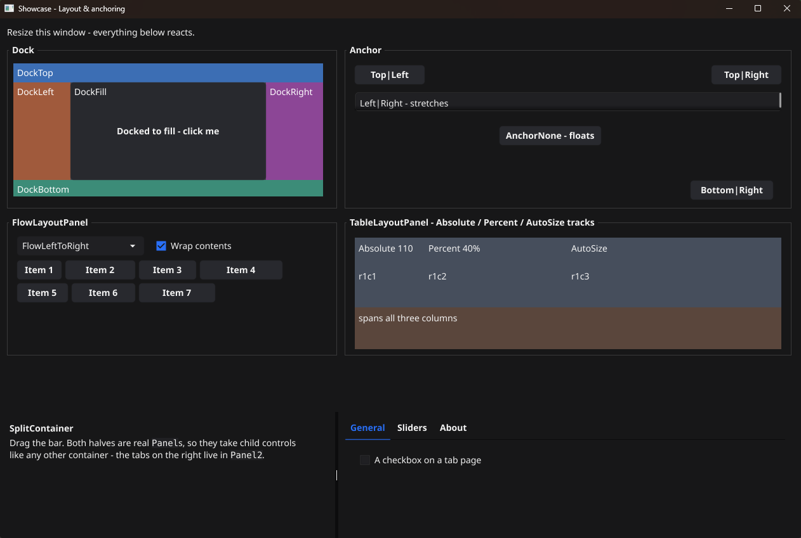
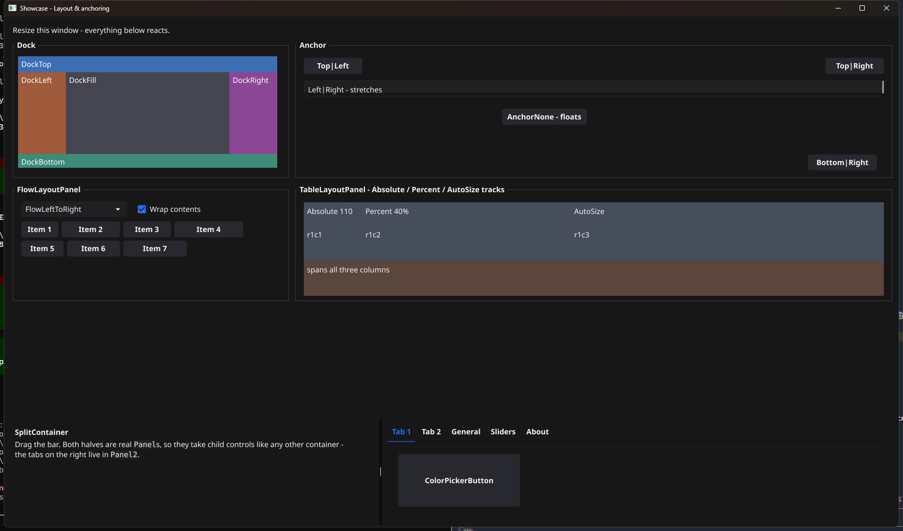

# Layout: docking, anchoring and containers

A form that only ever appears at its design size needs none of this. The moment
the user drags its edge, every control has to decide whether to move, stretch
or stay put - and GoForms decides it the way WinForms does.



The same form widened and made taller. The left column keeps its width, the
right one takes the space that opened up, the docked strip stays glued to the
bottom, and nothing overlaps:



## The order things happen in

When a parent is resized:

1. **Docked** children carve up the client area, in the order they were added.
2. Whatever rectangle is left becomes the **anchor frame**.
3. **Anchored** children are repositioned against that frame.

That order is why a control docked to the bottom can never be walked over by
an anchored control above it: the anchored control's frame stops where the
docked one begins.

## Docking

`SetDock` glues a control to one edge, and it takes the full width or height of
what is left:

```go
toolbar.SetDock(goforms.DockTop)     // full width, its own height
status.SetDock(goforms.DockBottom)   // full width, its own height
nav.SetDock(goforms.DockLeft)        // its own width, full remaining height
body.SetDock(goforms.DockFill)       // everything the others left
```

A docked control **ignores its own X and Y**. Its `SetBounds` still matters for
the one dimension the dock does not decide - the height of a `DockTop` strip,
the width of a `DockLeft` panel.

`DockFill` is applied last, and only the first one wins. Docking order is
significant: with a `DockLeft` added before a `DockTop`, the left panel reaches
the top of the client area and the top strip starts beside it; swap them and
the top strip spans the full width instead.

## Anchoring

`SetAnchor` fixes the distance between a control's edges and its parent's:

| Anchor | On resize |
|---|---|
| `AnchorTop \| AnchorLeft` | nothing moves (the WinForms default) |
| `AnchorTop \| AnchorRight` | slides right, keeps its width |
| `AnchorLeft \| AnchorRight` | **stretches** - both margins are kept |
| `AnchorTop \| AnchorBottom` | **stretches** vertically |
| all four | stretches in both directions |
| `AnchorNone` | floats: keeps its position proportionally |

Anchoring is measured against the geometry the control had when it was first
laid out - its design-time position, the same baseline the WinForms designer
records. Moving a control from your own code updates that baseline, so it
anchors from where you put it rather than snapping back.

## The trap: two columns that both stretch

This is the one that catches everybody, and it is worth stating plainly because
GoForms reproduces it exactly.

```go
// Two group boxes side by side, both anchored Left|Right.
left.SetBounds(12, 40, 520, 260)
left.SetAnchor(goforms.AnchorTop | goforms.AnchorLeft | goforms.AnchorRight)

right.SetBounds(544, 40, 520, 260)
right.SetAnchor(goforms.AnchorTop | goforms.AnchorLeft | goforms.AnchorRight)
```

`Left|Right` means *both* margins stay fixed, so each box grows by the parent's
whole width delta. The left box's right margin is 544px, so as the window
widens it grows 544px short of the right edge - straight through the box next
to it. Widen by 300 and they overlap by 288.

Measured, at a client width of 1376 where they were designed for 1076:

```
left  = [12 .. 832]     right margin kept at 544
right = [544 .. 1364]   right margin kept at 12
                        overlap: 288px
```

WinForms does the same thing. `Left|Right` on side-by-side controls is simply
not how you build a two-column layout.

### What to do instead

**One column fixed, the other stretching** - the common arrangement, and what
the showcase now uses:

```go
left.SetAnchor(goforms.AnchorTop | goforms.AnchorLeft)                        // fixed
right.SetAnchor(goforms.AnchorTop | goforms.AnchorLeft | goforms.AnchorRight) // stretches
```

**Both halves stretching equally** - a `SplitContainer`, whose two halves are
real `Panel`s that take children like any other container:

```go
split := goforms.NewSplitContainer(1000, 400, true) // true = vertical bar, left/right
split.SetDock(goforms.DockFill)
split.SetSplitterDistance(0.5)
split.Panel1().AddControl(left)
split.Panel2().AddControl(right)
```

**Proportional grids** - a `TableLayoutPanel` with percentage tracks, which
positions its children by cell rather than by bounds:

```go
table := goforms.NewTableLayoutPanel(800, 400, 2, 2)
table.SetColumnStyle(0, goforms.Percent(50))
table.SetColumnStyle(1, goforms.Percent(50))
table.AddControlAt(topLeft, 0, 0)
table.AddControlAt(topRight, 1, 0)
```

## Containers

Every container positions its children relative to **its own** top-left corner,
never the form's - as in WinForms, where `Location` is always parent-relative.

| Container | Children are placed by | Notes |
|---|---|---|
| `Panel` | bounds, docking, anchoring | the plain one |
| `GroupBox` | bounds, docking, anchoring | with a caption and frame |
| `ScrollBox` | bounds | scrolls a larger content area |
| `SplitContainer` | `Panel1()` / `Panel2()` | no `AddControl` of its own |
| `TabControl` | `TabPages()[i]` | no `AddControl` of its own |
| `ViewContainer` | `Pages()[i]` | tab strip on any edge, or hidden |
| `FlowLayoutPanel` | flow order | its own scheme; bounds are ignored |
| `TableLayoutPanel` | cell | its own scheme; bounds are ignored |

`SplitContainer`, `TabControl` and `ViewContainer` deserve care: they have **no
`AddControl` method**, because a control has to live in a specific half or page.

```go
split.Panel1().AddControl(btn)         // one half
tabs.TabPages()[1].AddControl(btn)     // the second tab
views.Pages()[0].AddControl(btn)       // the first page
```

Addressing a page by index rather than by keeping the value `AddTab` returned
means adding or removing tabs never leaves a dangling reference behind.

## Padding

`SetPadding` insets a container's client area before anything is laid out,
mirroring `Control.Padding`. Docked children start inside the padding, and the
anchor frame shrinks by it.

```go
panel.SetPadding(goforms.NewPadding(8))
```

## On a phone or in a browser

A window is whatever size the user made it; a phone screen and a browser tab
are whatever size they are, and the form does not get a say. So on both,
`AutoScroll` starts **on** - a form designed bigger than the screen scrolls
instead of losing the controls that do not fit. On the desktop it starts off,
which is WinForms' default, because there the window was sized to the form.

Two things follow on a phone, and both are worth designing around rather than
discovering:

**The form pans from anywhere, except where the control wants the drag
itself.** Dragging a group box, a label, a button or a panel scrolls the form
under it; dragging a `DataGridView` scrolls the grid, and dragging inside a
`TextBox` selects text, because those do something with a drag of their own.
A control inside a `ScrollBox` pans the `ScrollBox` rather than the whole
form - the nearest scroll wins.

That is worth designing around rather than relying on: a form two screens wide
is still two screens wide, and panning to a control is not finding it. The
designer's **android** project template starts at a phone-sized form for that
reason.

**The main window's menu costs it a strip.** Where a desktop puts a menu bar,
a phone puts a single hamburger button - and the driver draws it *over* the
top-left corner of the content, exactly where a WinForms layout puts its first
control. A form that called `SetMainMenu` reserves that button's height at the
top on a phone, so its (0,0) stays visible; a form without a menu is not
moved. Nothing about the form's own coordinates changes - `SetBounds(0, 0,
...)` is still the form's corner - the whole surface simply starts below the
button.

A second form opened on a phone is a full-screen child with a title bar of its
own, carrying the menu button and a close button, and the driver makes room
for that itself.

**Typing raises the keyboard by itself.** Touching a `TextBox` focuses it and
brings up the on-screen keyboard - the numeric one for a numeric field, the
password one for a masked field - and what is typed raises `KeyPress` on the
control the same as a hardware key would. Touching anything that takes no
typing puts the keyboard away.

## What the designer shows

The visual designer applies docking when it draws, so a docked control appears
where it will really be rather than at its stored coordinates - and it marks it
with a dashed outline, since dragging a docked control has no effect.

It does **not** yet mirror `FlowLayoutPanel` and `TableLayoutPanel`, which
place children by their own schemes. Children of those two are drawn at their
stored bounds, so treat the canvas as approximate inside them and check the
running form.
